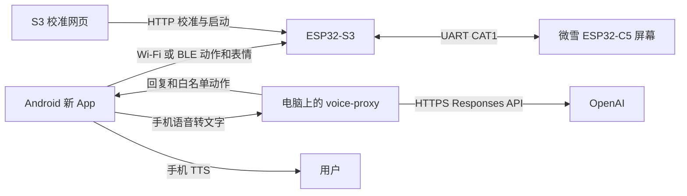

[README.md](https://github.com/user-attachments/files/33028951/README.md)
# DesktopCat 桌面招财猫

ESP32-S3 负责舵机、光敏、Wi-Fi 遥控和 BLE；微雪 ESP32-C5-Touch-LCD-1.69 负责屏幕表情与双板串口交互。新版 Android App 以旧 APK 的 Wi-Fi 遥控能力为基础，增加 BLE、云端对话和本地记录：手机识音后经电脑代理调用 OpenAI，再由手机播报回复。

> **项目状态**：这是依据课程 PPT、APK 接口和最终 3MF 重新整理的源码，并非原始固件的恢复版。作者在分模块测试中完成过 BLE 与 App 的连接；本仓库的新 Android App 已生成 0.2.0 调试版 APK，但 BLE 固件尚未在开发板编译、烧录及实机联调，App 也尚未手机实测。旧 APK 的 BLE 页面仍是“待接入”，新 App 是独立应用。

## 目录

| 路径 | 内容 |
|---|---|
| `CatS3Controller/` | S3：Wi-Fi 遥控、舵机校准、安全状态机、BLE GATT、UART |
| `CatC5Display/` | C5：五种猫脸、眨眼、UART 表情/动作协议、音频回放诊断 |
| `android-ble-voice/` | 新 Android App 源码：Wi-Fi/BLE 控制、手机语音识别与 TTS、云端对话记录 |
| `voice-proxy/` | Node.js 本地代理：保管 API key，调用 OpenAI Responses API |
| `API配置指南.md` | 电脑代理与手机 App 的逐步配置说明 |
| `tests/` | 不依赖开发板的协议与状态机测试 |
| `最终模型零件清单.csv` | 从最终两份 3MF 提取的 19 个对象清单 |


## 系统链路



模型回复不会直接变成舵机指令。只有用户输入**完全匹配**固定动作短句并再次确认才触发 Wi-Fi 或 BLE 指令；BLE 不提供 `arm` 或校准。先在 App 的 Wi-Fi 控制页或 S3 网页逐路校准、确认机械限位并启动，BLE 动作才会被接受。重启后 PWM 默认关闭。

## 环境与硬件

1. Arduino IDE 2.x，安装支持 ESP32-C5 的 Arduino-ESP32 3.x。S3 选 `ESP32S3 Dev Module`；C5 选 `ESP32C5 Dev Module` 并启用 **USB CDC On Boot**。
2. S3 安装 **NimBLE-Arduino 2.x**，代码使用 2.x 的 `NimBLEConnInfo` 回调签名。
3. C5 安装[微雪官方 Arduino 板级库](https://docs.waveshare.com/ESP32-C5-Touch-LCD-1.69/Development-Environment-Setup-Arduino)及其配套 **LVGL 8.4.0**，先确认官方 LCD 和 Mic/Speaker 示例能运行。
4. 分别打开两块板文件夹内的 `.ino` 编译、烧录。S3 模组具体子型号、舵机引脚和接线仍需对照实物。
5. 用 Android Studio 打开 `android-ble-voice/`，安装到 Android 8.0 及以上手机。工程包含 Gradle 8.10.2 Wrapper，首次同步需网络、JDK 17–23 和 Android SDK 35。在工程目录运行 `./gradlew assembleDebug`，APK 位于 `app/build/outputs/apk/debug/app-debug.apk`。

| S3 | C5 焊盘 | 作用 |
|---|---|---|
| GPIO17 TX | RX / GPIO12 | S3 → C5 |
| GPIO18 RX | TX / GPIO11 | C5 → S3 |
| GND | GND | 共地 |

串口为 115200、8N1、3.3 V。S3 舵机暂定 GPIO4–11 八路，光敏 DO 暂定 GPIO12，详见 `CatS3Controller/BoardConfig.h`。舵机单独供电并与开发板共地；光敏输出不得超过 3.3 V。第一次试动先卸下舵盘负载并逐路确认限位；默认 `1400–1600 μs` 只是试验起点。

## Wi-Fi 校准与原 APK

S3 默认热点 `DesktopCat`，初始密码写在 `CatS3Controller/BoardConfig.h`。新版 App 的“控制”页可连接 `http://192.168.4.1`，查看状态、执行动作与表情、启动和关闭 PWM；点“校准页面”会打开 S3 网页，`/remote` 也可单独使用。固件保留 `GET /api/status`、`POST /api/action`、`POST /api/mood`、`POST /api/calibration`、`POST /api/test`。所有通道默认禁用、未校准，确认后才可启动。`stop` 中断动作并保持当前 PWM；`release` 关闭 PWM，机构可能失去支撑。Wi-Fi API 仅用于实验网络，不要暴露公网。

## BLE 协议

S3 广播名 `DesktopCat-S3`。完整 GATT UUID：

| 用途 | UUID | 属性 |
|---|---|---|
| 服务 | `42d60001-7568-4f24-9ca4-9d1a4d3e0001` | 广播 |
| 命令 | `42d60002-7568-4f24-9ca4-9d1a4d3e0001` | Write |
| 回执 | `42d60003-7568-4f24-9ca4-9d1a4d3e0001` | Read / Notify |

1. 复制 `CatS3Controller/Secrets.example.h` 为 `CatS3Controller/Secrets.h`，把 `BLE_CONTROL_TOKEN` 改成随机的 **16–40 个 ASCII 字符**。实际文件已被 `.gitignore` 忽略。无令牌时可连接，但控制返回 `ERR:SET_TOKEN`。
2. Android App 中输入同一 BLE 令牌，授权“附近设备”，扫描连接。
3. 写入 UTF-8：`<令牌>|A:nod` 或 `<令牌>|M:happy`，每条不超过 80 字节。动作白名单为 `nod, shake, wave, wave_right, both, ears, center, dance, stop, release`；表情为 `auto, neutral, happy, curious, sleepy, angry`。App 不提供 BLE `release` 按钮，关闭 PWM 需通过 Wi-Fi 操作。
4. 订阅回执。例如 `ACTION:nod:OK` 表示已接受，`DISARMED` 表示尚未从网页启动，`BUSY` 表示正在执行上一动作。`OK` 不是完成信号。

BLE 回调只把消息放入队列，舵机控制留在主循环。令牌提供附近设备的应用层访问控制；当前 BLE 链路**未实现配对加密**，只适合受控实验环境。

## 云端语音

目前的链路是 **手机语音识别 → 局域网代理 → OpenAI 文字对话 → 手机 TTS**。新 App 会在本机私有存储中保存最近 20 条用户/猫咪消息（约 10 轮），重新打开后仍可查看；下一次提问时一并发送这些记录，使云端回复能接续上下文。“清空对话记录”会删除本机保存的消息。代理不持久化对话，云端请求设置 `store:false`；本机记录未做额外加密，不要在共用手机上保存敏感内容。C5 板上的麦克风和扬声器现在只有默认关闭的回放诊断；**板载录音上传和板载云端播报尚未完成**。

完整图文步骤见 [API配置指南.md](API配置指南.md)。在能联网的电脑上安装 Node.js 20+，进入 `voice-proxy/`，在终端设置环境变量，真实密钥不要写入仓库：

```sh
export OPENAI_API_KEY='在 OpenAI API 平台创建的密钥'
export DESKTOPCAT_PROXY_TOKEN='自己生成的至少 16 字符随机令牌'
export OPENAI_MODEL='gpt-4.1-mini'
export DESKTOPCAT_HOST='0.0.0.0'
node server.mjs
```

手机与电脑连接同一可信局域网，在新 App 填入 `http://电脑局域网IP:8787` 和代理令牌，再输入文字或点“手机语音输入”。代理提供 `GET /health` 与 `POST /ask`。后者需 `Authorization: Bearer <DESKTOPCAT_PROXY_TOKEN>`，请求体如 `{"text":"你好","history":[{"role":"user","content":"早上好"},{"role":"assistant","content":"早上好呀"}]}`；`history` 可为空，代理限制为最多 20 条。API key 只在电脑进程中使用。局域网 HTTP 未加密，不要做公网端口映射；跨不可信网络应配置 HTTPS。仅本机调试时可使用默认 `127.0.0.1`。

**关于“连接这个 GPT 账号”**：不能直接读取本次 ChatGPT/Codex 登录状态或把聊天会话当 API 密钥。[OpenAI 官方 Sign in with ChatGPT](https://developers.openai.com/siwc/token-sharing-open-source) 允许符合条件的开源本地应用在用户授权后用其 ChatGPT 方案调用指定的 **Responses API**，但需要完整的 OAuth 注册、PKCE、令牌保存/刷新和账户模型选择；[预览限制](https://developers.openai.com/siwc/token-sharing-open-source/preview-limitations)明确不支持音频输入和转录。本仓库未实现该 OAuth 流程。当前代理使用用户自行创建的 OpenAI API key；它可以属于同一个 OpenAI 登录账户，但 API 使用与 ChatGPT 订阅授权并非同一件事，还需要该 API 项目的可用额度。如果坚持使用 ChatGPT 方案，下一阶段可把手机识音后的**文字**接入正式 SIWC OAuth，音频仍由手机本地能力处理。

## 本地验证

在仓库根目录执行：

```sh
clang++ -std=c++17 -Wall -Wextra -fsanitize=address,undefined tests/ble_protocol_test.cpp -o /tmp/desktopcat_ble_test && /tmp/desktopcat_ble_test
clang++ -std=c++17 -Wall -Wextra -Wno-unused-parameter -fsanitize=address,undefined -I tests/stubs tests/s3_logic_test.cpp -o /tmp/desktopcat_s3_test && /tmp/desktopcat_s3_test
clang++ -std=c++20 -Wall -Wextra -Wno-unused-parameter -fsanitize=address,undefined -I tests/stubs tests/c5_logic_test.cpp -o /tmp/desktopcat_c5_test && /tmp/desktopcat_c5_test
cd voice-proxy && node --test
```

主机测试检查 BLE 令牌和白名单、舵机状态机、C5 串口逻辑及代理请求边界。Android 工程已使用 Android SDK 35、Gradle 8.10.2 执行 `assembleDebug` 并通过签名和 ZIP 对齐检查。**双板固件目标编译、BLE 实连、手机安装测试和云端真实调用仍待验证**。

## 资料与联调顺序

- [微雪板卡资料](https://docs.waveshare.com/ESP32-C5-Touch-LCD-1.69)
- [微雪 Arduino 示例](https://docs.waveshare.com/ESP32-C5-Touch-LCD-1.69/Development-Environment-Setup-Arduino)
- [NimBLE-Arduino 2.x 指南](https://github.com/h2zero/NimBLE-Arduino/blob/master/docs/New_user_guide.md)
- [Android BLE 权限](https://developer.android.com/develop/connectivity/bluetooth/bt-permissions)
- [OpenAI Responses API 文本生成](https://developers.openai.com/api/docs/guides/text)

先确认 S3 广播和 BLE 回执，再在 Android 上测试按钮和 `DISARMED`/`OK`，接着试一条已校准的舵机，最后运行手机语音与代理。C5 板载云端语音需先确认官方 BSP 的 PCM 采样率、通道格式和可用内存，再做录音分帧、上传和播放；现有回放诊断不应写成已完成的云端语音。
